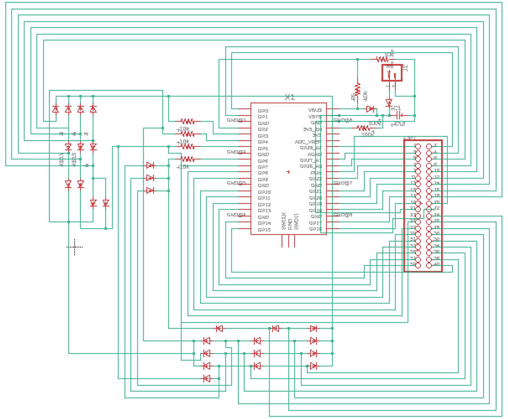

### Devoloped by [Drew Griggs](http://fabacademy.org/2021/labs/charlotte/students/drew-griggs/about/) and [Teddy Warner](https://teddywarner.org/About-Me/about/).

## Documentation -

Our project idea, as discussed with RhythmLink, is a continuity testing rig. This project will be capable of testing and displaying the results of the pinout connections between two ends of a cable with different headers. Our goal is to create a continuity testing rig capable of testing and displaying the connections between the ends of two different cable headers. We will display the results to a webpage using the Raspberry Pico W microcontroller.

The concept behind this project is simple, but our method of display, as well as some methods to reduce the GPIO pins required for the microcontroller will be quite complex, so we worry that we might run into some issues here. The most challenging part of this project will likely be getting the web server to run correctly, as we will be using a RPI Pico W to host the server, but there are very few examples of a project such as this compared to something like an Arduino. A successful project would be able to test the continuity in real time and refresh the users web browser through a visually appealing display.

We used a few sources as guides to setting up a RPI web server, mainly Tom’s Hardware and the Raspberry Pi website - see the *sources* section below.

Our project is significantly more complex than these simple web servers, however, as we will refresh the page automatically, include some javascript and more complex HTML elements to improve the aesthetic, not to mention the continuity testing aspects.

Through the development of the project, we learned a great deal about the principles of static site design, multimedia design with 3D printing, and the integration of software and hardware components. As we developed the initial design stages of the project, we reminded ourselves of the horrors of debugging, going through countless coexisting issues that were causing the failure of our project. As we built up our initial prototype, we discovered, and ultimately resolved, issues involving our diode array, web server generation, board design, and many more. Similarly to our Fab Academy projects, we had many parts working in conjunction with each other. As we traversed the design and manufacturing process, we once again were reminded of the difficulty of getting each component of the project successfully integrated. At times, we would wonder from which component of the project our errors arose from.

Some of the major issues we encountered were due to errors in the board design. Due to an oversight in the main board, we did not include diodes for the final point of connection between each diode chain and output pin, which caused issues with reading pins that should not be high. Furthermore, we had an issue with our self test function. We initially decided to implement transistors to toggle and check each output and input pin, but due to voltage jumping between Gate and Drain despite no Source voltage, this part was unsuccessful. As such, we will not be making any further changes to the prototype, other than implementing a basic self test function with a predetermined cable.

### Electronic Design

The testing rig will likely consist of two separate boards, one main logic and interpretation board and one header board. The logic board will include a RPi Pico W to host the server and interpret data, a power regulation module, a diode array to reduce specific pins into their binary values (to conserve GPIO pins), and a large 2x20 pin header. The header board will include the connectors for each end of the cable and the 2x20 pin connector, as well as a possible self test function to ensure the functionality of the rig. The self test will include a jump between specific pins on each module, and an LED that will flash green assuming the test passes.

We used a few methods to allow the project to be operable on the Raspberry Pico. We designed and implemented an array of diodes to convert any individual input into a binary representation of its pin value, allowing us to test and read 15 possible different wires through 4 input pins. For the header connector board, we designed custom eagle footprints and libraries for the two types of connectors, as well as adding self-test circuits that will connect pins through the switch of a transistor.

Our project went somewhat to plan. Due to some issues in the testing of our board due to the precision of our lab’s PCB mills as well as the complexity of our board, we had some issues testing the main board. We eventually fixed a bug in the diode array, and the main board was working. The header board took less time, as it was less complex, but due to some issues with voltages jumping across transistors despite no source voltage, we were unable to include our initially planned self test function. After discussions with Rhythmlink, however, we determined that this would not be an issue, and since the board worked without the transistors soldered, we continued with testing. Web and software design and testing took the majority of our allocated time, as this was the first project of this type for both of us, so it took some getting used to programming a web server through micropython.

We mostly used tools oriented to PCB design in our project. We spent the majority of our machine use on the Bantam PCB mills, with some 3D printing of our enclosure towards the end of our project. Our files were EagleCad .sch and .brd schematic and boards, python files, fusion project files, and html files.

### Software

The operation of the Pico makes designing and editing a webpage in real time very annoying. It requires a string object to be sent through a library in the Pico, so we had to code a way to implement the updates of the test through splicing strings together. Apart from some hiccups in the testing of this component, however, the code was fairly simple. It loops through each of nine output pins, and reads the corresponding binary value of the input pins that corresponds to the pin number in the header cable.

### CAD

### Testinghttps://github.com/Twarner491/ContunityTestingRig/blob/main/assets/ContTestWorking.mp4
<video src="[./assets/ContTestWorking.mp4](https://github.com/Twarner491/ContunityTestingRig/blob/main/assets/ContTestWorking.mp4)" width="320" height="240" controls></video>

<video width="800" controls>
  <source src="https://github.com/Twarner491/ContunityTestingRig/blob/main/assets/ContTestWorking.mp4" type="video/mp4">
</video>

<video width="800" controls>
  <source src="./assets/FinalConTestRig.mov" type="video/mov">
</video>

### Assembly Instructions

- Download necessary files from github (link above)
- 3D print outer case
- Order or manufacture main and header board
- Solder components to each board
- Download Thonny and the python script
- Use dupont connectors and solid wires to create header cable adapters
- Add your wifi information to the ssid and password in the python file
- Boot the pico w with the boot file. Instructions can be found on raspberry pico article
- Run the script

## Sources -
 - [https://www.tomshardware.com/how-to/raspberry-pi-pico-setup](https://www.tomshardware.com/how-to/raspberry-pi-pico-setup)
 - [https://datasheets.raspberrypi.com/picow/pico-w-datasheet.pdf](https://datasheets.raspberrypi.com/picow/pico-w-datasheet.pdf)

---
- [Fork this repository](https://github.com/Twarner491/ContunityTestingRig/fork)
- [Watch this repo](https://github.com/Twarner491/ContunityTestingRig/subscription)
- [Create issue](https://github.com/Twarner491/ContunityTestingRig/issues/new)
